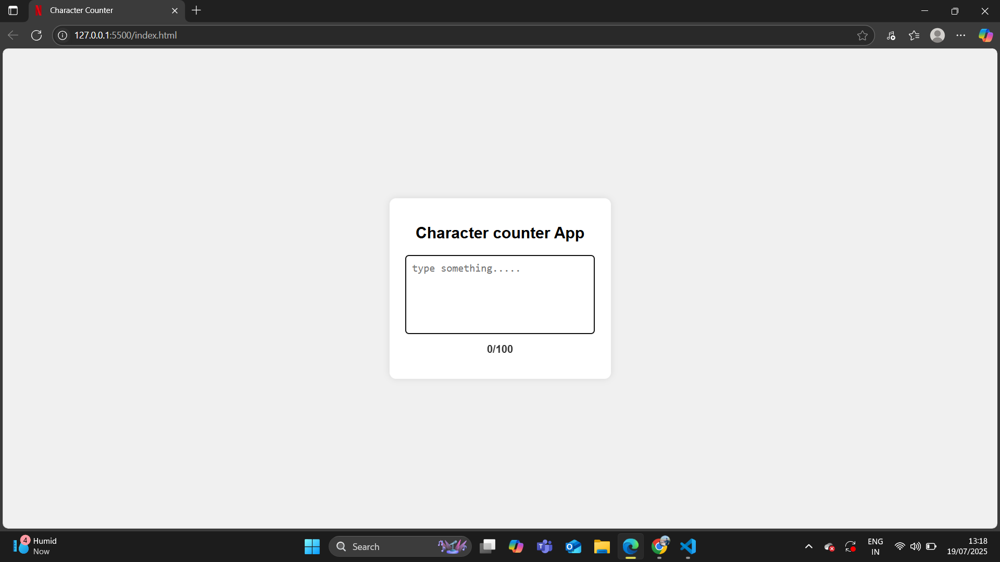

# Character Counter App

A simple web application that counts the number of characters typed in a textarea and displays the count in real time. If the character limit is reached, the counter turns red.

---

## 🚀 Features
- Live character counting.
- Displays the number of characters out of a maximum limit.
- Counter text color changes to red when the limit is reached.
- Simple and clean UI.

---

## 🛠️ Tech Stack
- **HTML5**
- **CSS3**
- **JavaScript (Vanilla JS)**

---

## 📂 Project Structure
Character-Counter-App/
│
├── index.html
├── style.css
└── script.js

---

## 📸 Screenshot

---

## 🌐 Live Demo
[Click Here to View Live Demo](https://charcter-counter-app.netlify.app/)

---

## 💡 How to Use
1. Type any text into the textarea.
2. The character count will update automatically.
3. If you reach the limit (100 characters), the counter will turn red.
